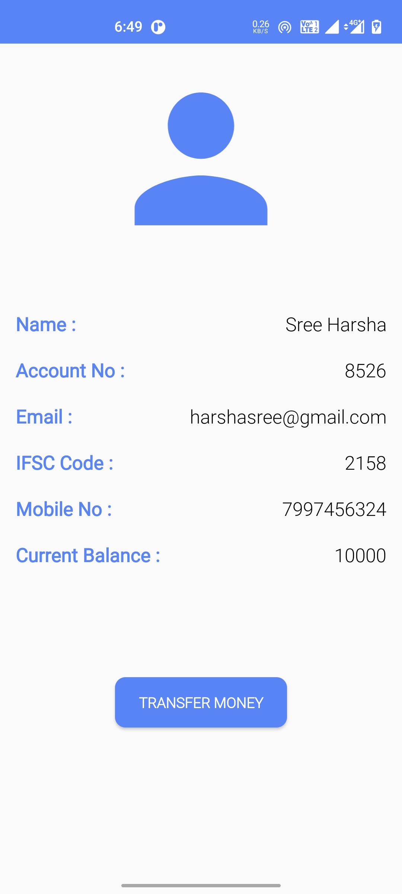
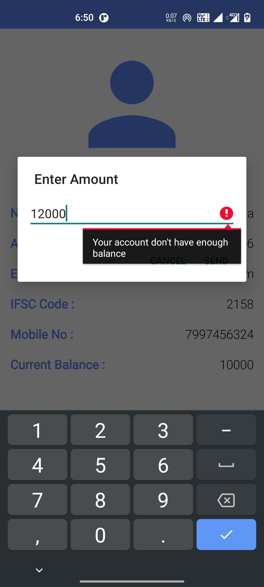
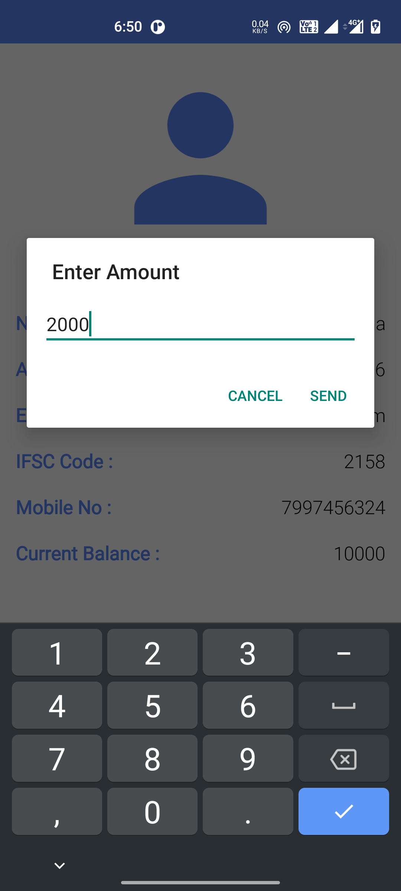
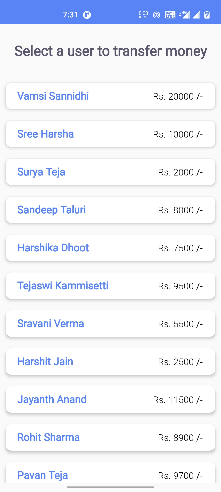
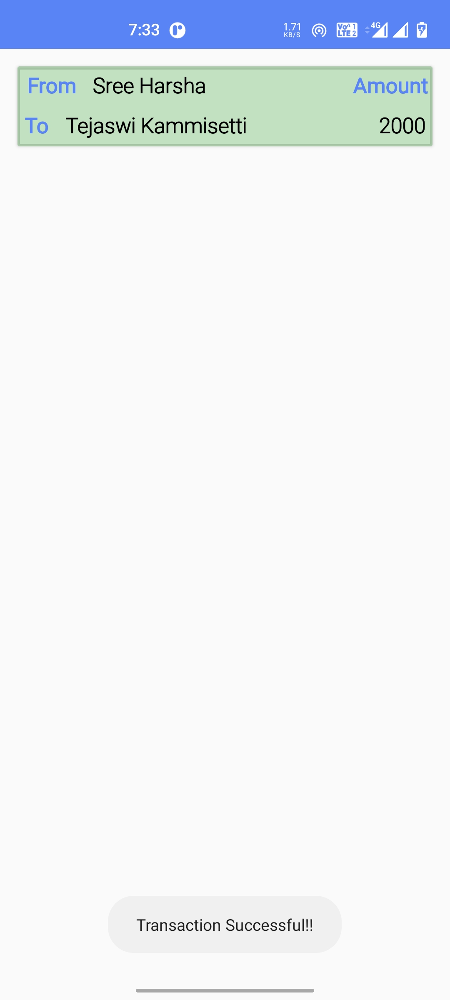
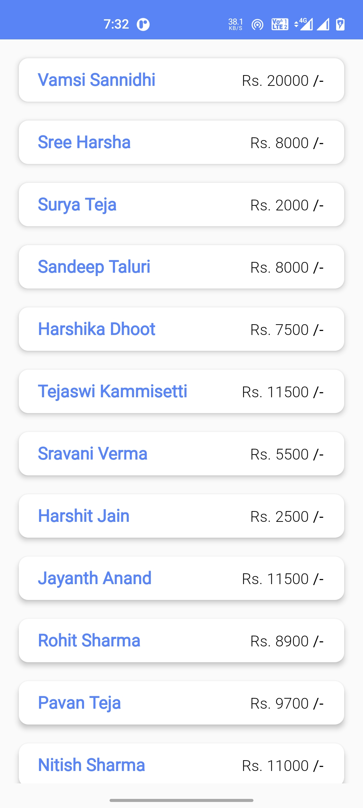

# BankingSystemsApp
## Description
* Banking System App which keeps track of its users and their transaction history.
* Uses MYSQLite for Database storage.

## Author
* Sree Harsha - aka [HarshaStrix][website]
* My Portfolio Website - [(myfolio-strixblog)][website]

[website]: https://myfolio-strixblog.web.app/

## Screenshots
### HomeScreen

### Users List

### Users Data

### Transfer Amount
  

### Select User To Transfer Money

### Transaction Successful

### Updated Amount In Users List

### Transaction History Showing Successfull & Cancelled Transactions

### Project Explanation
##### YouTube Link : https://youtu.be/92fbI2gNAbo
